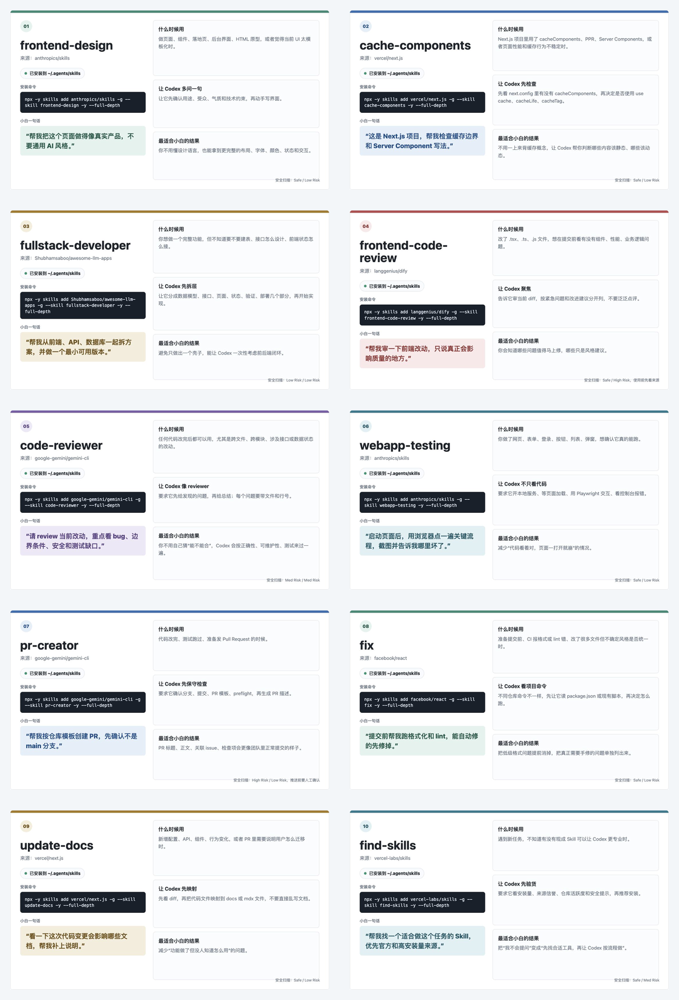

# 小白用 Codex 时怎么用得更好

这是给公众号文章配套的 Codex 小白上手包：一篇文章、10 个研发场景 Skills、一键安装脚本和配图。

## 一键安装

```bash
curl -fsSL https://raw.githubusercontent.com/siuserxiaowei/codex-skills-guide/main/codex-dev-skills/install.sh | bash
```

安装完成后，重启 Codex，让新安装的 Skills 生效。

## 文章

- [公众号文章稿：小白用 Codex 时怎么用得更好](article.md)
- [10 个 Skills 安装说明](codex-dev-skills/README.md)

## 配图



单张截图在：

```text
assets/codex-skills-install/screenshots/
```
